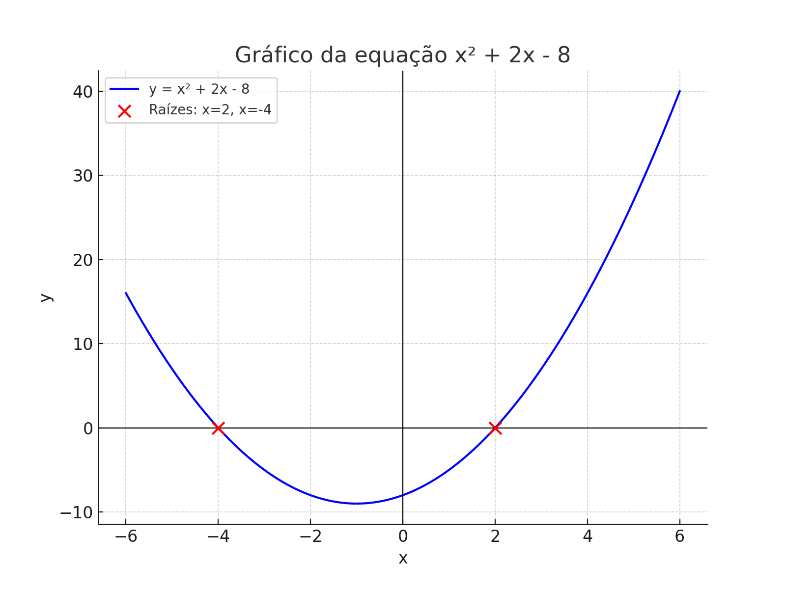

# 🧾 Sistema de Controle Financeiro Pessoal

## **📝 Descrição do Sistema**

O sistema tem como objetivo permitir o **controle completo das finanças pessoais** do usuário, oferecendo funcionalidades que abrangem desde o **cadastro de contas bancárias e cartões de crédito** até o **lançamento e acompanhamento de contas a pagar e a receber**.

Também contempla **transferências entre contas**, **consultas de extratos**, **classificação de despesas e receitas** por centro de custo e **integração automática da movimentação bancária**.

---

## **✅ Requisitos Funcionais (RF)**

**RF01.** O sistema deve permitir o cadastro, edição e exclusão de **usuários**.

**RF02.** O sistema deve permitir o **cadastro de contas bancárias**, com informações como nome, número, banco e saldo inicial.

**RF03.** O sistema deve possibilitar o **registro de cartões de crédito**, com dados como limite, data de fechamento e vencimento.

**RF04.** O sistema deve permitir o **lançamento de contas a pagar e a receber**, vinculadas a centros de custo e entidades.

**RF05.** O sistema deve permitir **baixar lançamentos financeiros**, atualizando o valor pago/recebido e o status correspondente.

**RF06.** Ao realizar uma baixa, o sistema deve **gerar automaticamente um MovimentoConta associado**.

**RF07.** O sistema deve permitir o **registro de pagamentos e recebimentos** vinculados a lançamentos financeiros.

**RF08.** O sistema deve permitir **transferências entre contas**, gerando uma transação única com débito na conta de origem e crédito na conta de destino.

**RF09.** O sistema deve calcular e exibir **extratos por período**, apresentando saldo inicial, movimentações e saldo final.

**RF10.** O sistema deve permitir **classificar receitas e despesas** por centro de custo.

**RF11.** O sistema deve permitir o **vínculo de lançamentos a entidades geradoras**, como lojas ou empregadores.

**RF12.** O sistema deve permitir **fechar faturas de cartões de crédito**, impedindo novos lançamentos após o fechamento.

**RF13.** O sistema deve permitir **registrar o pagamento de faturas**, gerando automaticamente um débito na conta bancária.

**RF14.** O sistema deve permitir **consultas e relatórios** de movimentações, receitas, despesas e saldos consolidados.

**RF15.** O sistema deve manter **registro de auditoria** com data de criação e atualização (`criadoEm`, `atualizadoEm`) em todas as entidades.

**RF16.** O sistema deve **validar transferências**, impedindo que sejam realizadas entre a mesma conta.

**RF17.** O sistema deve **impedir movimentações** em contas marcadas como inativas.

**RF18.** O extrato deve ser **calculado dinamicamente** com base no saldo inicial da conta e nas movimentações registradas.

---

## **⚙️ Requisitos Não Funcionais (RNF)**

**RNF01.** O sistema deve possuir **interface responsiva**, acessível em dispositivos desktop e mobile.

**RNF02.** O tempo máximo de resposta para consultas de extrato e relatórios deve ser **inferior a 3 segundos**.

**RNF03.** O sistema deve armazenar os dados em um **banco relacional (ex: PostgreSQL)**, garantindo integridade referencial.

**RNF04.** O sistema deve garantir **persistência e consistência transacional**, especialmente nas operações de baixa e transferência.

**RNF05.** Todas as ações de inserção, alteração e exclusão devem ser **registradas em logs de auditoria**.

**RNF06.** O sistema deve seguir **boas práticas de segurança**, com autenticação por senha criptografada e controle de sessão.

**RNF07.** O sistema deve permitir **backup e restauração de dados** financeiros.

**RNF08.** O layout deve ser **intuitivo e de fácil navegação**, priorizando clareza nas telas de extrato e lançamentos.

**RNF09.** O sistema deve ser **compatível com os principais navegadores modernos** (Chrome, Edge, Firefox).

**RNF10.** Deve estar preparado para **suportar múltiplos usuários simultâneos** sem degradação perceptível de desempenho.

teste 123